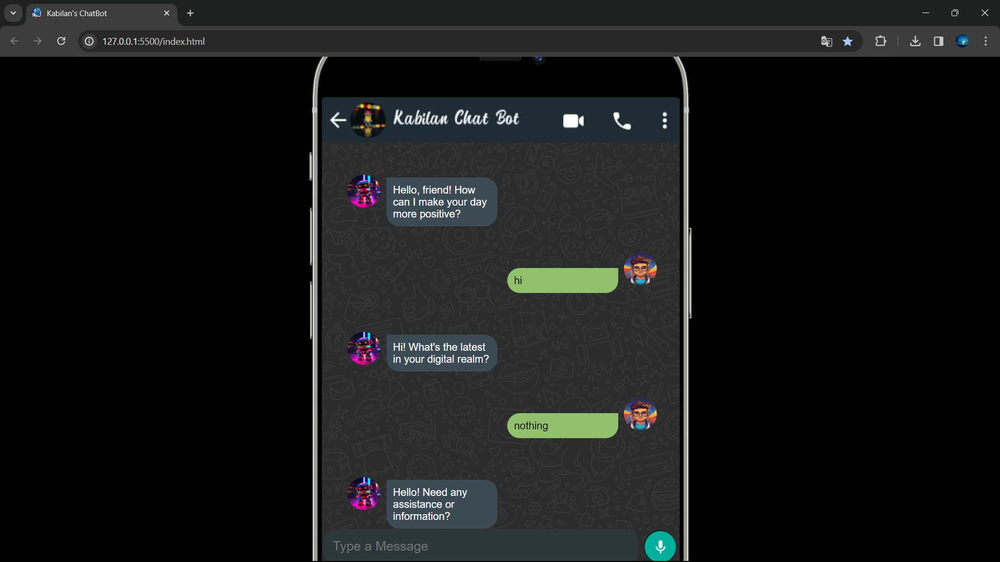

# Chatbot Project

This is a simple chatbot project implemented using HTML, CSS, and JavaScript.

## Overview

The project consists of the following files:

- `index.html`: The main HTML file containing the structure of the chatbot.
- `styles.css`: The CSS file for styling the chatbot interface.
- `script.js`: The JavaScript file handling the chatbot functionality.
- `botresponses.json`: JSON file containing predefined responses for the chatbot.

## Bot Responses Configuration (botresponses.json)

The `botresponses.json` file contains a list of predefined responses used by the chatbot. You can customize or extend this file to tailor the chatbot's behavior.

Example structure:
```json
{
  "greetings": ["Hello!", "Hi there!", "Greetings!"],
  "farewells": ["Goodbye!", "See you later!", "Farewell!"]
}
```
## Screenshots and GIFs


*Desktop View*


*Mobile View*
## Getting Started

1. Clone the repository:

    ```bash
    git clone https://github.com/kabilankavi131/ChatBot.git
    ```

2. Open `index.html` in your preferred web browser.

3. Interact with the chatbot and enjoy!

## Usage

Feel free to customize the chatbot's content, appearance, and functionality according to your needs. Add more features, integrate with APIs, or improve the user interface.

## Contributing

If you'd like to contribute to this project, please follow these steps:

1. Fork the repository.

2. Create a new branch:

    ```bash
    git checkout -b feature/your-feature
    ```

3. Make your changes and commit them:

    ```bash
    git commit -m "Add your feature"
    ```

4. Push to the branch:

    ```bash
    git push origin feature/your-feature
    ```

5. Open a pull request.
